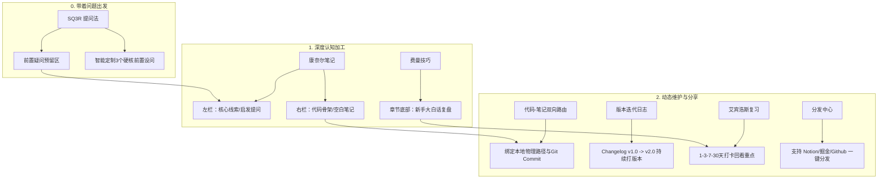

# 🧠 notes-structure-skill (学习笔记与大纲架构师)

<p align="center">
  
  
  
</p>

> **基于自学科学理论与现代知识管理体系（PKM）设计的自学笔记大纲定制引擎。**

---

## 🎯 解决的核心痛点

在传统的自学过程中，我们常常面临以下三大难题：
1.  **“收藏即学会”的幻觉**：机械地复制文档、抄写代码，大脑处于被动的“低加工状态”，记完笔记很快就忘。
2.  **“笔记垃圾堆”的债务**：笔记写完就丢，无法在后续实践中持续迭代演进，最终成为死知识。
3.  **“代码与笔记脱节”**：看笔记时找不到当时跑通的 Demo，看代码时又想不起背后的原理，缺乏路由追踪。

`notes-structure-skill` 旨在利用 AI 代理，根据您具体的**学习主题**与**应用目标**，为您定制生成兼顾**“自学理解”**、**“传播分享”**以及**“生命周期维护”**的真空 Markdown 学习笔记大纲。

---

## 🗺️ 科学学习与维护架构图

本项目深度融合了学习心理学与软件工程中的版本管理思想，将笔记视为“活的软件”进行设计：



---

## 🧠 融入的学术理论支柱

*   **SQ3R 学习法 (Questioning)**：在大纲首要位置设计「前置问题探索清单」，通过问题迫使大脑进行**“主动信息检索”**。
*   **康奈尔笔记法 (Cornell Notes)**：将正文任务里程碑（Milestones）拆分为 `[💡 核心线索/启发提问]` 与 `[📝 学习笔记与代码细节]` 的对照框架，促成概念深度绑定。
*   **费曼技巧 (Feynman Technique)**：每个核心里程碑后留有「白话教学输出栏」，用最简单、不带术语的语言解释给新手听，从而自我验证。
*   **蔡格尼克效应 (Zeigarnik Effect)**：增设 **「⏳ 蔡格尼克悬案箱」**，收集学习中途产生的临时盲区并挂牌，促进潜意识在日常中继续寻找答案。

---

## 📁 规范的仓库结构

```text
notes-structure-skill/
├── .gitignore
├── LICENSE
├── README.md                                     # 本项目主文档
├── agency-learning-notebook-architect/           # 技能命名目录 (满足 gh skill 的 */SKILL.md 匹配规范)
│   └── SKILL.md                                  # 核心 AI 技能行为规范文件
└── examples/
    └── docker_nodejs_example.md                  # 场景定制化生成的空白笔记大纲范例
```

---

## 🚀 安装与集成

### 1. 使用 `gh skill` 一键安装（推荐）
如果您配置了 `gh skill` 扩展，可以直接在您的终端运行以下命令：

```bash
gh skill install nickyang/notes-structure-skill
```

### 2. 手动克隆集成
您可以直接克隆本项目，并将项目子目录下的 `SKILL.md` 拷贝到您自己项目的 `.agents/skills/agency-learning-notebook-architect/` 目录中即可激活：

```bash
# 克隆项目
git clone https://github.com/nickyang/notes-structure-skill.git

# 创建宿主项目中的技能目录，并将 SKILL.md 写入其中
mkdir -p /path/to/your-project/.agents/skills/agency-learning-notebook-architect
cp notes-structure-skill/agency-learning-notebook-architect/SKILL.md /path/to/your-project/.agents/skills/agency-learning-notebook-architect/
```

---

## 💻 运行与唤醒示例

启动您的 AI 代理，向其发送具体的目标描述指令，例如：

> **我输入**：
> 我想学习 `Docker`，我的具体学习目标是 `在生产环境中打包并安全部署一个 Node.js (Express) Web 应用，要求尽可能压缩镜像体积，并解决容器内应用崩溃无法自动重启的问题。`

> **AI 代理将依据 SKILL 规范为您输出**：
> 高度场景化定制的空白大纲笔记模板。您可以查阅 [examples/docker_nodejs_example.md](examples/docker_nodejs_example.md) 直观感受生成的笔记在元数据管理、双链路由、避坑调试日志及温故打卡上的极致细节。

---

## 📄 许可证

本项目基于 [MIT License](LICENSE) 协议开源。
