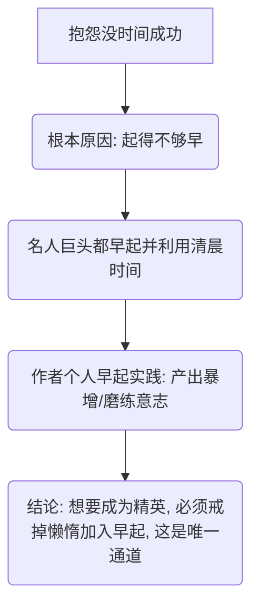

# 文章信息解构报告：《为什么你必须坚持早起：成功的唯一秘密》

这份报告对文章《为什么你必须坚持早起：成功的唯一秘密》进行了系统性的信息解构，拆解了其核心观点、事实论据、逻辑链条，并对其中的逻辑漏洞与潜在偏见进行了批判性分析。

---

## 1. 基本信息
*   **文章标题**：《为什么你必须坚持早起：成功的唯一秘密》
*   **核心主旨**：早起是实现成功和通往卓越的唯一途径。每个人都应该戒掉懒惰，通过早起来获取更多时间和洗礼意志。

---

## 2. 核心观点与论断
*   **观点 A**：人们抱怨没有时间成功，根本原因在于起得不够早。
*   **观点 B**：世界上最富有的人都有早起的共同习惯，这是他们取得普通人无法企及的成就的根本原因（抓住清晨宝贵时间）。
*   **观点 C**：早起能够唤醒体内的“成功因子”，磨练意志。
*   **观点 D**：早起是通往卓越的**唯一**通道。

---

## 3. 事实与论据梳理
文章主要通过以下三类论据来支持其核心观点：

| 论据类型 | 具体内容 | 作用/意图 |
| :--- | :--- | :--- |
| **研究结论** | 科学研究表明，世界上最富有的人都有一个共同习惯——早起。 | 提供普适性的“科学”背景支持。 |
| **名人案例** | ① 苹果公司 CEO 蒂姆·库克（Tim Cook）每天早上 3:45 开始发邮件。 ② 迪士尼前 CEO 罗伯特·艾格（Robert Iger）每天 4:30 起床看报纸。 | 利用权威/成功人士的作息为观点背书。 |
| **作者个人经历** | 作者曾是夜猫子，强迫自己 5:00 起床。第一周适应困难，第二周即可在他人熟睡时完成**两万字**的写作。 | 提供亲身实证，展示早起的即时成效和意志洗礼。 |

---

## 4. 论证逻辑与推导链条
文章的论证路线图如下：

---

## 5. 批判性分析（逻辑漏洞与潜在偏见）
在对文章进行理性解构后，可以发现以下明显的逻辑漏洞和认知偏差：

### ① 绝对化陈述与极端化谬误（False Dilemma / Single Cause Fallacy）
*   **表现**：文章称早起是“成功的唯一秘密”、“通往卓越的唯一通道”。
*   **分析**：成功是一个多维度因素共同作用的结果（包括能力、机遇、资源、选择、努力等）。将成功完全归因于“早起”这一单一变量，忽略了其他关键因素，属于严重的单一归因谬误。同时，许多夜猫子型的科学家、艺术家和企业家也取得了巨大的成功，早起并非唯一通道。

### ② 幸存者偏差与相关性谬误（Survivorship Bias & Correlation vs. Causation）
*   **表现**：列举库克和艾格早起的例子，证明早起让他们取得普通人无法企及的成就。
*   **分析**：
    *   **因果倒置/相关非因果**：库克和艾格的早起与他们的成功之间是相关关系，而非因果关系。他们可能因为身处高位、日常事务极其繁重，不得不早起处理工作，而不是因为早起才当上了 CEO。
    *   **幸存者偏差**：只看到早起且成功的精英（幸存者），忽略了无数同样每天早起（如环卫工人、早餐摊贩、早班通勤族）但并未成为社会定义下的“富有精英”的人，也忽略了晚起但同样成功的精英。

### ③ 事实可信度存疑
*   **表现**：作者声称在每天 5 点起床的第二周，“在大家都在熟睡时，我已经完成了两万字的写作”。
*   **分析**：
    *   即使按 5:00 到普通人起床的 8:00 计算，清晨仅有 3 个小时。在 3 小时内完成 2 万字写作意味着平均每小时写作近 7000 字。在没有任何大纲、构思且刚摆脱“行尸走肉”状态的第二周，这一高强度持续产出在生理和智力上都极不合常理，存在夸大个人经历、制造焦虑的嫌疑。

---

## 6. 行动建议与结论
*   **文章建议**：
    *   立即行动：戒掉懒惰，加入早起行列，哪怕只是提早半小时。
*   **解构后的理性建议**：
    *   **关注精力管理而非单纯的时间管理**：早起的前提是保证充足的睡眠和高效的精力。如果为了早起而导致睡眠不足，反而会降低全天的决策质量和工作效率。
    *   **寻找个人生物钟节奏**：了解自己是“百灵鸟型（早起型）”还是“猫头鹰型（晚起型）”，在个人精力最充沛的黄金时间处理核心事务，而非盲目跟风精英的作息表。
