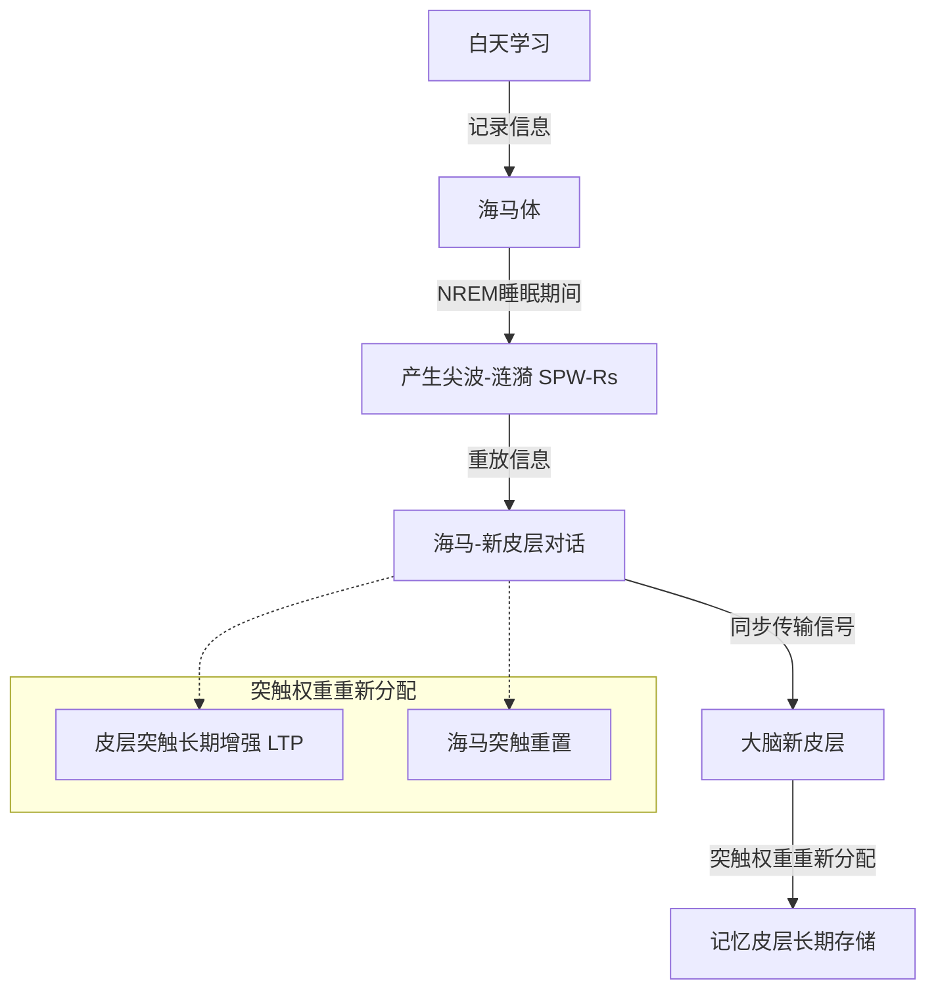

# 《海马体与睡眠巩固：短期记忆转化为长期记忆的突触机制》信息解构

## 1. 核心概念与定义
* **记忆巩固 (Memory Consolidation)**：新编码的、不稳定的短期记忆转化为稳定长期记忆的过程。
* **尖波-涟漪 (SPW-Rs, Sharp-Wave Ripples)**：在非快速眼动（NREM）睡眠期间，海马体产生的高频振荡（150-250 Hz）。
* **海马-新皮层对话 (Hippocampal-neocortical dialogue)**：海马体与大脑新皮层之间的同步信号传输机制，用于重新分配突触权重并转移记忆。

## 2. 关键实验数据与证据
* **实验对象**：小鼠
* **实验条件**：剥夺小鼠 24 小时睡眠
* **实验结果**：海马体 CA1 区脑片突触的**长时程增强（LTP）诱导率下降了 42%**。
* **相关性发现**：NREM 睡眠期间 SPW-Rs 的发生频率与**前一天学习的新任务数量呈正相关**。

## 3. 突触机制与信息转移路径
信息在海马体与大脑新皮层之间的转移和巩固遵循以下机制：

**详细步骤**：
1. **信息记录**：白天学习时，海马体记录新编码的短期记忆。
2. **信息重放**：在 NREM 睡眠的慢波活动（SWA）期间，海马体以高频振荡（SPW-Rs，150-250 Hz）的形式重放白天记录的信息。
3. **信号传输**：通过“海马-新皮层对话”，将重放的信号同步传输至大脑新皮层。
4. **权重重配与存储**：
   * **皮层突触**：发生长期增强（LTP）。
   * **海马突触**：重置，为下一次学习做准备。
   * **最终结果**：记忆成功转移至大脑新皮层进行长期存储。

## 4. 关键后果与影响（睡眠不足的影响）
* 慢波睡眠（NREM睡眠中的慢波活动）不足会导致：
  * **记忆转移机制受阻**：海马体与新皮层之间的对话无法有效进行。
  * **记忆遗忘与干扰**：新学习的短期记忆无法转化为长期记忆，导致其极易受到新信息的干扰或被直接遗忘。
