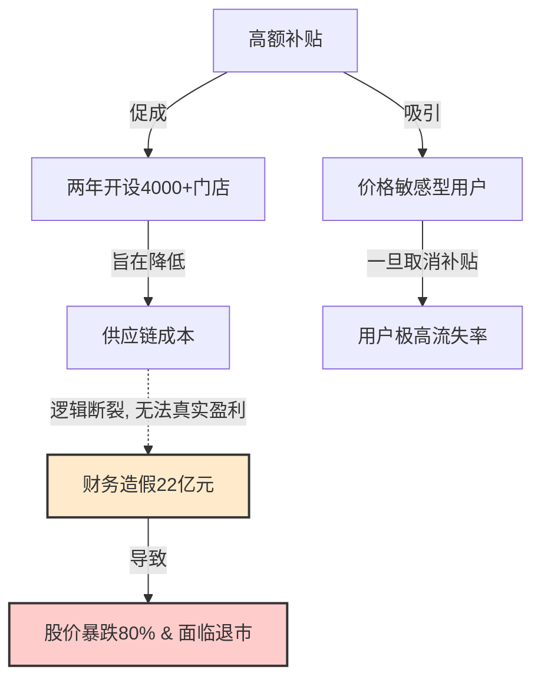

# 《瑞幸咖啡的兴衰：商业逻辑与泡沫游戏》信息解构报告

## 一、 基本信息
* **分析对象**：《瑞幸咖啡的兴衰：商业逻辑与泡沫游戏》
* **核心主题**：瑞幸咖啡的商业模式逻辑、财务造假丑闻及其背后的泡沫本质与商业常识反思。

## 二、 核心事实梳理
1. **崛起阶段（2018年 - 2020年）**：
   * **时间线**：2018年进入中国咖啡市场。
   * **扩张手段**：通过海量分发优惠券（首杯免费，之后打折）获取用户。
   * **扩张规模**：在短短两年内开设了超过 4000 家门店。
2. **危机阶段（2020年）**：
   * **核心事件**：被爆出虚增了 22 亿元人民币的交易额（财务造假丑闻）。
   * **直接后果**：股价暴跌 80%，并面临退市。

## 三、 商业模式与逻辑链条拆解
### 1. 核心商业逻辑（理论传导链条）
瑞幸的核心商业模式逻辑可以被拆解为以下三个阶段的演进：
$$\text{高额补贴获取用户 (A)} \rightarrow \text{做大门店规模以压低供应链成本 (B)} \rightarrow \text{停止补贴后依靠用户粘性实现盈利 (C)}$$
**简明公式**：补贴 $\rightarrow$ 用户规模增加 & 供应链规模效应 $\rightarrow$ 单杯成本下降 $\rightarrow$ 盈利。

### 2. 逻辑断裂原因分析
该商业模型在实际执行中未能闭环，主要因为以下三个致命错位：
* **用户画像错位**：咖啡虽然是高频刚需，但瑞幸的消费者大多是**价格敏感型**。
* **用户粘性失效**：由于消费者对价格高度敏感，一旦取消补贴，流失率极高，导致无法过渡到阶段 (C)（依靠用户粘性实现盈利）。
* **以造假维持泡沫**：在真实商业逻辑断裂、无法实现盈利的情况下，创始团队通过虚增 22 亿元交易额的财务造假方式来掩盖问题，维持“规模与故事”的泡沫。

## 四、 核心观点与论断提取
### 1. 被批判的价值偏见
* **投资人观点**：“只要故事讲得好，规模足够大，就一定能割资本主义韭菜”。
* **作者定性**：这完全是一种荒谬的价值偏见。

### 2. 作者的核心论断与反思
* **商业本质**：一切不以盈利为目的的商业泡沫终究会破裂。
* **思维误区**：试图用“互联网思维”去重新定义咖啡行业，本质上是一场疯狂的赌博，是对传统商业常识的蔑视。
* **回归路径**：我们必须坚信，唯有脚踏实地做产品，才能赢得市场。

## 五、 信息关系与架构图

