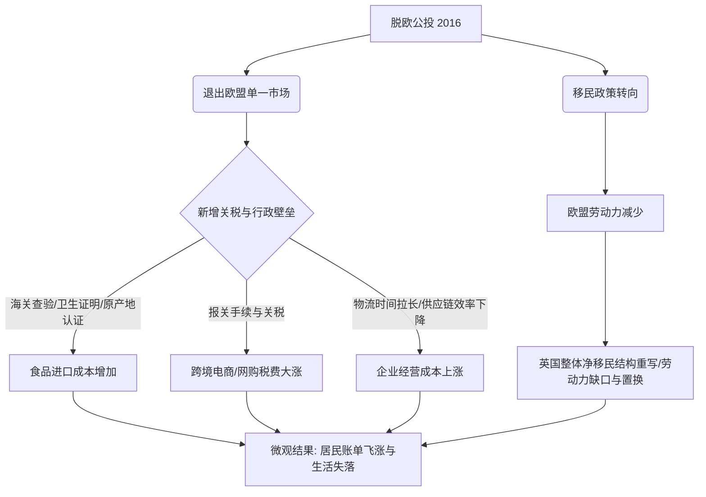

# 《十年脱欧路：一名英国人的账单与失落》信息解构报告

本报告对文章《十年脱欧路：一名英国人的账单与失落》进行了深度的结构化信息解构，旨在提炼英国脱欧十周年之际，宏观政治决策如何传导并影响微观的个体生活账单、商业经营及社会民意。

---

## 一、 报告概览

* **核心主题**：英国脱欧十周年之际，宏观政治层面的口号（如“重新掌握命运”、“把钱拿回来”）与普通民众在日常生活、出行、跨境消费及商业经营中所面临的账单暴涨、物流迟滞及政治动荡之间的巨大落差。
* **核心矛盾**：十年来政坛动荡不安（首相频繁更替，10年换6任），但普通人关心的民生生活未得改善；支持脱欧者期望“控制边境、减少移民”，实际却迎来历史新高的移民规模与移民结构的被动重写。

---

## 二、 关键人物与视角

| 人物/机构 | 身份/背景 | 核心观察视角与体验 |
| :--- | :--- | :--- |
| **Kevin** | 51岁，英国伯明翰唐人街中餐馆老板，返欧派。 | **微观生活与商业经营感知者**：通过常年记账，对食品、牛奶、能源、出行（停车费、拥堵费、火车罢工）及餐馆采购成本、德国网购咖啡机海关税费有直接且具体的账单体验。 |
| **Erik** | 考文垂在读博士。 | **青年及劳动力底层感知者**：受能源价格上涨冲击，不得不通过打零工（代购、跑腿、代写论文）来补贴生活开支，承受时间与经济的双重压力。 |
| **崔洪建** | 北京外国语大学区域与全球治理高等研究院教授。 | **宏观政治与学术分析者**：分析脱欧派政治传播的叙事技巧（将经济问题绑定主权与认同），以及指出公投本是保守党为解决内部矛盾的政治工具，最终改变了国家方向。 |
| **伦敦政治经济学院 (LSE)** | 权威学术机构。 | **宏观量化数据提供者**：量化新增的海关查验与卫生证明等程序对家庭食品支出的影响（年均多支出约210英镑）。 |

---

## 三、 数据解构：脱欧后的“英国账单”

以下为文章中提及的各项具体数据对比及变化趋势：

### 1. 个人生活与出行账单

| 费用项目 | 脱欧前/前几年水平 | 2026年前后（当前）水平 | 涨幅/变动情况 |
| :--- | :--- | :--- | :--- |
| **伦敦停车费** | $\le 5$ 英镑 / 小时 | $8$ 英镑 / 小时 | 涨幅 $\ge 60\%$ |
| **伦敦拥堵费** | $15$ 英镑 | $18$ 英镑（自2026年1月起） | 涨幅 $20\%$（漏缴罚款约80英镑） |
| **伯明翰-伦敦半天出行** | - | 多付近 $100$ 英镑 | 包含拥堵费、停车费上涨及火车罢工被迫开车的额外支出 |
| **两升装牛奶** | $< 1$ 英镑 | 近乎翻倍（约 $2$ 英镑） | 涨幅约 $100\%$ |
| **黄瓜** | $50$ 便士 | 近乎翻倍（约 $1$ 英镑） | 涨幅约 $100\%$ |
| **家庭日用和食品月开支** | $300 - 400$ 英镑 | 近 $1000$ 英镑 | 涨幅达 $150\% - 233\%$ |
| **冬季电费、燃气费** | $< 50$ 英镑（2021年前） | 近 $150$ 英镑 | 涨幅达 $200\%$ |
| **餐厅水电气月账单（Kevin）**| $338$ 英镑（2026年1月） | $400$ 英镑（2026年4月） | 仅一季度内上涨约 $18.3\%$ |
| **塑料袋价格** | 较低 | $0.5$ 英镑 / 个 | 迫使居民“缩紧口袋”把菜装入衣兜 |

### 2. 商业经营与宏观经济数据

* **跨境网购税费**：从德国购买二手咖啡机，进入英国海关后额外缴纳**近 300 英镑**的税费和手续费（此前单一市场时几乎为零）。
* **农产品出口规模**：英国出口至欧盟的农产品规模较脱欧前**下降近四成 (40%)**。
* **英国家庭年食品额外支出**：由于海关查验、卫生证明和原产地认证等新增程序，英国家庭平均每年多支出**约 210 英镑**。
* **跨境物流时间**：由过去的“一周左右送达”变为因报关、检验和物流环节增加而“经常被拉长”。

### 3. 净移民规模与来源变化

* **脱欧前一年 (2015)**：英国净移民为 **32.1 万人**，主要来自欧盟国家（如东欧国家）。
* **脱欧后 (至2023年前后)**：净移民不降反升，达到 **94.4 万人**的历史高位。
* **来源国结构变化**：欧盟（如东欧）劳动力流失；印度、巴基斯坦和尼日利亚背景的移民和经营者成为主力，“人仍在增加，但换了一批人”。

---

## 四、 核心议题与机制解构

### 1. “重回命运”与“现实代价”的冲突

脱欧派在公投前构建了极具感染力的宏观政治叙事，而留欧派仅在提醒未发生的代价。然而，十年的现实账单证明了宏观愿景在微观执行中的失效：

### 2. 政治动荡的“告别仪式”化
* **辞职潮**：2016年脱欧公投以来，英国已历经 **6 任首相辞职**（卡梅伦、特蕾莎·梅、约翰逊、特拉斯、苏纳克、斯塔默），无一能做满完整任期，这折射出下议院多数席位维持之艰难以及脱欧善后工作的政治破坏力。
* **政治形式化**：对于普通民众而言，首相在唐宁街10号发表告别演说已沦为“令人熟悉的政治仪式”，政客更关心自身席位，而无法根本解决火车罢工、公用事业费高企等民生顽疾。

### 3. 民意逆转与“后悔潮”
* **民调现状**：
  * 多数受访民众支持英国重新加入欧盟。
  * **约 55%** 的受访者支持英国重新加入欧盟。
  * **约 70%** 的人希望与欧盟建立更紧密的合作关系。
  * **超过两成 (20%+)** 当年投票支持脱欧的选民后悔当年的选择。
* **生活压力外化**：从超市塑料袋的计较，到博士生疯狂兼职，再到市中心“要求政府控制物价”的持续性温和集会，公众情绪已从十年前的政治论辩转变为对漫长生活压力的隐忍与外化表达。

---

## 五、 报告结论

《十年脱欧路》提供了一个典型的**宏观政治理想在微观经济现实中着陆失败**的样本。支持脱欧的选民在十年前买单了“夺回控制权”的口号，但在十年后，他们收到的却是一张包括牛奶、能源、快递税费和拥堵费在内的多维通胀账单。政治承诺的“自主性”在现实复杂的供应链壁垒 and 劳动力替代中被消解，导致了当下英国社会广泛存在的失落感与“返欧”思潮的抬头。
